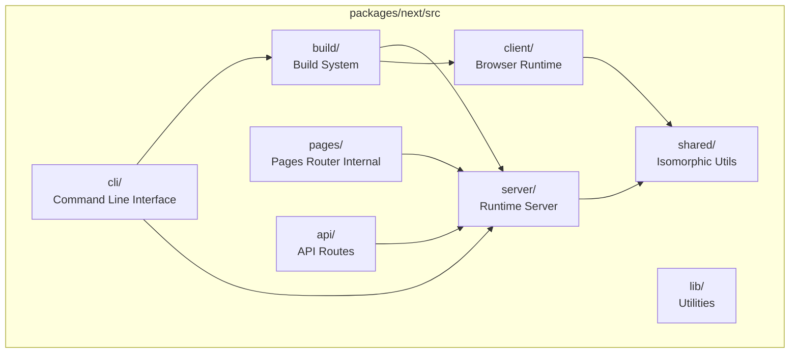
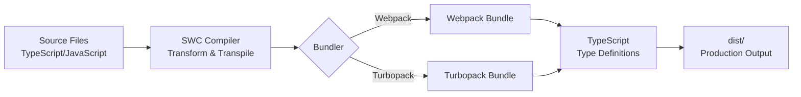
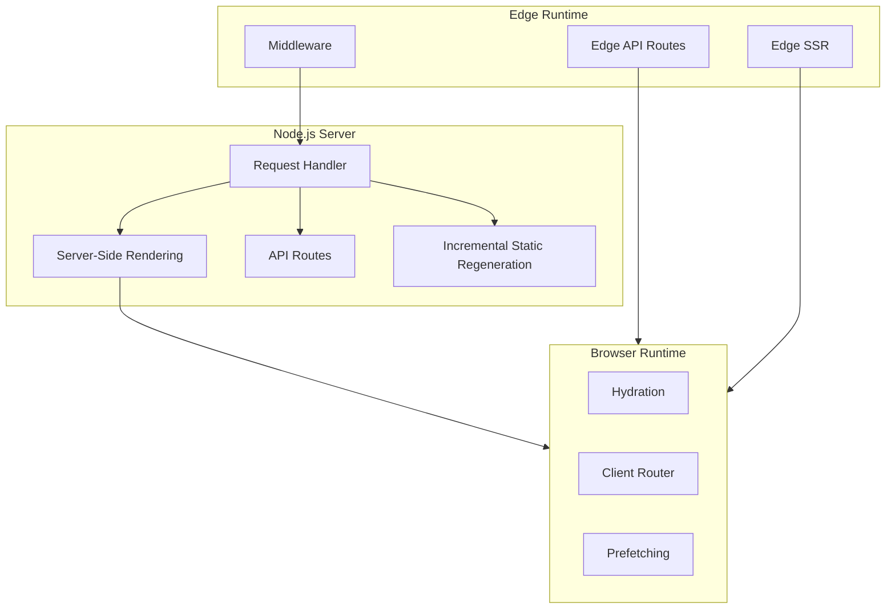
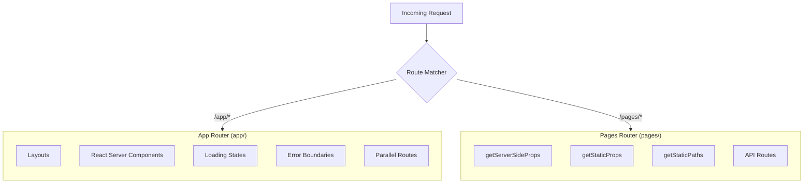
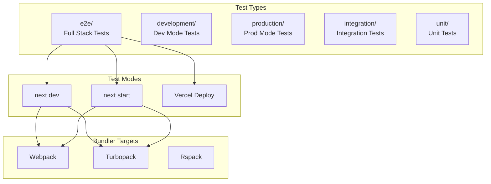
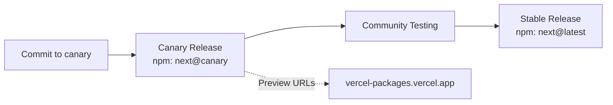

# Next.js Architecture Overview

## Introduction

This document provides a high-level architectural overview of the Next.js framework for new core maintainers. It covers the major components, data flows, interfaces, and development workflows without diving into low-level implementation details.

**Target Audience:** Core maintainers, contributors, and technical architects

**Scope:** Repository structure, build pipelines, runtime behaviors, release channels, and key interfaces

---

## Table of Contents

1. [Repository Structure](#repository-structure)
2. [Core Package Architecture](#core-package-architecture)
3. [Build Pipeline](#build-pipeline)
4. [Runtime Architecture](#runtime-architecture)
5. [Routing Systems](#routing-systems)
6. [Compiler Infrastructure](#compiler-infrastructure)
7. [Test Infrastructure](#test-infrastructure)
8. [Development Workflow](#development-workflow)
9. [Release Channels](#release-channels)
10. [Key Interfaces & Contracts](#key-interfaces--contracts)

---

## Repository Structure

Next.js is a monorepo managed with **pnpm workspaces**, **Lerna**, and **Turborepo**. The repository contains JavaScript/TypeScript packages alongside Rust crates for native performance-critical code.

```mermaid
graph TB
    accTitle: Next.js Repository Structure
    accDescr: High-level view of Next.js monorepo organization
    
    subgraph Root["Root"]
        PKG[package.json]
        TURBO[turbo.json]
        CARGO[Cargo.toml]
    end
    
    subgraph Packages["packages/"]
        NEXT[next<br/>Core Framework]
        CNA[create-next-app<br/>CLI Scaffolding]
        SWC[@next/swc<br/>Rust Bindings]
        FONT[font<br/>Font Optimization]
        MDX[@next/mdx<br/>MDX Support]
        ESLINT[eslint-config-next<br/>Linting]
        ENV[@next/env<br/>Environment Loading]
        THIRD[third-parties<br/>Analytics & Scripts]
    end
    
    subgraph Crates["crates/"]
        NAPI[napi<br/>Node.js Bindings]
        NEXTAPI[next-api<br/>Turbopack Integration]
        NEXTBUILD[next-build<br/>Build Pipeline]
        NEXTCORE[next-core<br/>Core Transforms]
        TRANSFORMS[next-custom-transforms<br/>SWC Plugins]
    end
    
    subgraph Testing["test/"]
        E2E[e2e/]
        UNIT[unit/]
        INT[integration/]
        DEV[development/]
        PROD[production/]
    end
    
    Root --> Packages
    Root --> Crates
    Root --> Testing
```

### Key Directories

| Directory | Purpose |
|-----------|---------|
| `packages/` | NPM packages published to registry |
| `crates/` | Rust crates for native performance |
| `test/` | Test suites (e2e, unit, integration) |
| `docs/` | Documentation source files |
| `examples/` | Reference implementations |
| `errors/` | Error documentation pages |
| `contributing/` | Contributor guides |

---

## Core Package Architecture

The `packages/next` package is the heart of the framework. It contains all client and server runtime code, the build system, and the CLI.



### Module Responsibilities

| Module | Responsibility |
|--------|----------------|
| `cli/` | `next dev`, `next build`, `next start`, `next lint` commands |
| `build/` | Webpack/Turbopack configuration, compilation, optimization |
| `server/` | Request handling, SSR, SSG, ISR, API routes, middleware |
| `client/` | Browser hydration, client-side navigation, prefetching |
| `shared/` | Utilities shared between server and client |
| `lib/` | Internal utilities and helpers |

---

## Build Pipeline

The build process transforms TypeScript/JavaScript source into optimized bundles for production.



### Build Commands

| Command | Purpose |
|---------|---------|
| `pnpm build` | Full production build |
| `pnpm dev` | Watch mode for development |
| `pnpm types` | Generate TypeScript declarations |
| `pnpm swc-build-native` | Build Rust/native components |

### Build Tasks (via Taskr)

The build orchestration uses [taskr](https://www.npmjs.com/package/taskr) with tasks defined in `packages/next/taskfile.js`:

1. **Compile with SWC** - Transform TypeScript sources
2. **Bundle with Webpack** - Create optimized bundles (config: `next-runtime.webpack-config.js`)
3. **Generate Types** - Produce `.d.ts` declaration files

---

## Runtime Architecture

Next.js operates across multiple runtime environments with different capabilities.



### Server Types

| Server | File | Purpose |
|--------|------|---------|
| Base Server | `base-server.ts` | Abstract base class with common logic |
| Next Server | `next-server.ts` | Full Node.js server implementation |
| Dev Server | `dev/` | Development server with HMR |
| Web Server | `web/` | Edge-compatible server |

### Request Flow

1. **Ingress** → Request received at server
2. **Middleware** → Edge middleware processing (if configured)
3. **Routing** → Match route to handler
4. **Rendering** → SSR/SSG/ISR execution
5. **Response** → HTML/JSON/Stream output to client

---

## Routing Systems

Next.js supports two routing paradigms that coexist in the framework.



### Routing Comparison

| Feature | App Router | Pages Router |
|---------|------------|--------------|
| Directory | `app/` | `pages/` |
| Data Fetching | `fetch()` with caching | `getServerSideProps/getStaticProps` |
| Components | Server Components default | Client Components default |
| Layouts | Nested, preserved | Per-page |
| Streaming | Native support | Limited |

---

## Compiler Infrastructure

Next.js uses SWC (Rust-based) as its primary compiler, replacing Babel for performance.

```mermaid
flowchart LR
    accTitle: Next.js Compiler Stack
    accDescr: How SWC integrates with Next.js compilation
    
    subgraph Rust["Rust Layer (crates/)"]
        SWC_CORE[SWC Core]
        TRANSFORMS[Custom Transforms]
        NAPI_BIND[NAPI Bindings]
    end
    
    subgraph Node["Node.js Layer"]
        NEXT_SWC[@next/swc]
        WEBPACK_LOADER[Webpack Loader]
        TURBO_LOADER[Turbopack Loader]
    end
    
    SWC_CORE --> TRANSFORMS
    TRANSFORMS --> NAPI_BIND
    NAPI_BIND --> NEXT_SWC
    NEXT_SWC --> WEBPACK_LOADER
    NEXT_SWC --> TURBO_LOADER
```

### Compiler Features

| Feature | Configuration |
|---------|--------------|
| Styled Components | `compiler.styledComponents` |
| Emotion | `compiler.emotion` |
| Relay | `compiler.relay` |
| Remove Console | `compiler.removeConsole` |
| React Remove Properties | `compiler.reactRemoveProperties` |
| Minification | Built-in (since v13) |

### Crate Responsibilities

| Crate | Purpose |
|-------|---------|
| `napi/` | Node.js bindings via N-API |
| `next-api/` | Turbopack integration APIs |
| `next-build/` | Build pipeline coordination |
| `next-core/` | Core transformation logic |
| `next-custom-transforms/` | SWC plugin implementations |

---

## Test Infrastructure

Next.js has a comprehensive test suite organized by test type and execution environment.



### Test Commands

| Command | Description |
|---------|-------------|
| `pnpm test-dev` | Run tests in development mode (Webpack) |
| `pnpm test-start` | Run tests in production mode |
| `pnpm test-dev-turbo` | Run tests with Turbopack |
| `pnpm testonly` | Run tests with visible browser |
| `pnpm test-unit` | Run unit tests only |

### Test Environment Variables

| Variable | Purpose |
|----------|---------|
| `NEXT_TEST_MODE` | Set test mode (`dev`, `start`, `deploy`) |
| `NEXT_TEST_SKIP_CLEANUP` | Preserve temp files for debugging |
| `NEXT_SKIP_ISOLATE` | Run in repo instead of temp dir |
| `HEADLESS` | Run browser in headless mode |

---

## Development Workflow

### Local Setup

1. **Prerequisites**
   - Node.js ≥ 20.9.0
   - pnpm 9.6.0 (via corepack)
   - Rust toolchain (via rustup)
   - GitHub CLI

2. **Clone & Install**
   ```bash
   gh repo clone vercel/next.js -- --filter=blob:none --branch canary
   pnpm install
   ```

3. **Development Mode**
   ```bash
   pnpm dev        # Watch mode
   pnpm types      # Generate types (separate terminal)
   ```

4. **Testing Changes**
   ```bash
   pnpm pack-next --tar                    # Create tarballs
   pnpm unpack-next path/to/test-project   # Install in test project
   ```

### Branch Strategy

| Branch | Purpose |
|--------|---------|
| `canary` | Development branch, all PRs target here |
| `main` | Stable releases |

---

## Release Channels



### Release Types

| Channel | npm Tag | Cadence | Use Case |
|---------|---------|---------|----------|
| Canary | `@canary` | Per commit | Early testing |
| Stable | `@latest` | Scheduled | Production use |

### Preview Builds

Every branch build creates tarballs accessible via:
- **By Commit:** `https://vercel-packages.vercel.app/next/commits/{SHA}/next`
- **By PR:** `https://vercel-packages.vercel.app/next/prs/{PR_NUMBER}/next`

---

## Key Interfaces & Contracts

### Configuration Interface

`next.config.js` / `next.config.ts` is the primary configuration surface:

| Config Area | Key Options |
|-------------|-------------|
| Compilation | `compiler.*`, `transpilePackages` |
| Images | `images.domains`, `images.loader` |
| Routing | `rewrites`, `redirects`, `headers` |
| Build | `output`, `distDir`, `pageExtensions` |
| Experimental | `experimental.*` |

### Public APIs

| API | Import | Purpose |
|-----|--------|---------|
| `next/link` | Client | Client-side navigation |
| `next/image` | Client/Server | Optimized images |
| `next/router` | Client | Pages Router navigation |
| `next/navigation` | Client | App Router navigation |
| `next/headers` | Server | Read request headers |
| `next/server` | Server | Middleware & Edge APIs |

### CLI Interface

| Command | Options | Purpose |
|---------|---------|---------|
| `next dev` | `-p`, `--turbopack` | Development server |
| `next build` | `--debug`, `--profile` | Production build |
| `next start` | `-p`, `-H` | Production server |
| `next lint` | `--fix`, `--dir` | ESLint checking |
| `next info` | - | Environment info |

---

## Information Requested

The following items would help complete this documentation:

- [ ] **Turbopack Status:** What is the current production-readiness status of Turbopack vs Webpack?
- [ ] **Rspack Integration:** What is the scope and timeline for Rspack support?
- [ ] **SLA/SLO Targets:** Are there defined performance targets for builds or runtime?
- [ ] **Security Boundary:** What security review process exists for changes to server/edge runtimes?

---

<small>Generated with GitHub Copilot as directed by hashi</small>
